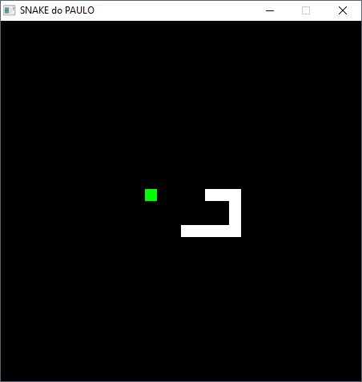

# Snake game clone in Pygame (Python SDL)

Video preview: https://youtu.be/uaXgmDN2RYQ



I made this when I was studying Pygame many years ago: it is a clone of the Snake game, done in Python with the SDL library Pygame. Note: it works, but I never finished it (no score count, no boundaries logic, no start or end screen). 

The logic could be improved, if I did this today it would have less lines, other logic and cleaner. But for study material it is ok. 

Everyone can use this in any way they like, I don't care about licenses or copyright, just have fun.

##How to run:
If you don't have Python installed simply run the file "main.exe" - I compiled it from the Python source with Pyinstaller: "pyinstaller.exe --onefile --windowed main.py"
Note: I have not tested it in the .exe format.

To run the source code like a boss the only requirement is:
-An installed version of Python (used 2.7, not tested with other versions)
-Pygame (don't remeber what version I used at the time, but the current one in 2018 seems to be working ok)

To get pygame just install it through the comand line with:
```pip install pygame
```

Then just run the file "main.py". 

##How to play:
Use the arrow keys (up, right, down, left) to control the movement, catch the green squares to grow, if you touch yourself (pun not intended) you loose.

##Contacts:
My Homepage: [www.paulojorgepm.net](http://www.paulojorgepm.net)
